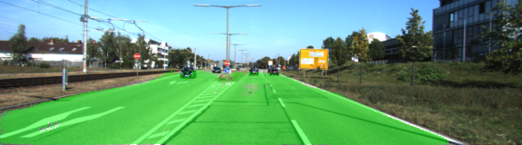
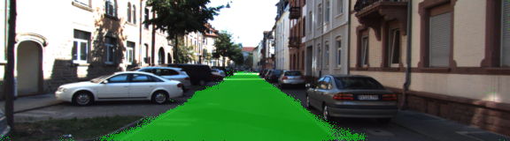
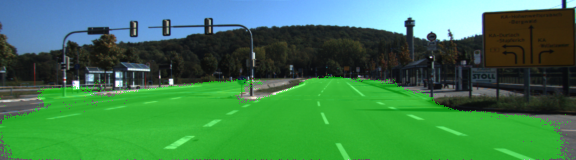

# Semantic Segmentation

#### NOTE: This README has parts of it borrowed from the original project repository [here](https://github.com/udacity/CarND-Semantic-Segmentation).


### Introduction
In this project, we label the pixels of a road in images using a Fully Convolutional Network (FCN).

### Setup
##### GPU
`main.py` will check to make sure you are using GPU - if you don't have a GPU on your system, you can use AWS or another cloud computing platform.
##### Frameworks and Packages
Make sure you have the following is installed:
 - [Python 3](https://www.python.org/)
 - [TensorFlow](https://www.tensorflow.org/)
 - [NumPy](http://www.numpy.org/)
 - [SciPy](https://www.scipy.org/)

You may also need [Python Image Library (PIL)](https://pillow.readthedocs.io/) for SciPy's `imresize` function.

##### Dataset
Download the [Kitti Road dataset](http://www.cvlibs.net/datasets/kitti/eval_road.php) from [here](http://www.cvlibs.net/download.php?file=data_road.zip).  Extract the dataset in the `data` folder.  This will create the folder `data_road` with all the training a test images.

### Start
##### Implement
The following functions in `main.py` are implemented:

`load_vgg`
This function loads the pretrained base VGG16 model. Later, it extracts the input, layers 3, 4 and 7 for the next step.

`layers`
This builds the Fully Convolutional Network (FCN). It takes layers 3, 4 and 7 and adds skip connections. The reasons for this are contained in the paper [Fully Convolutional Networks for Semantic Segmentation](https://arxiv.org/pdf/1605.06211.pdf).

In section 4.3, and further under header "Skip Architectures for Segmentation" and Figure 3, they note these provided for 8x, 16x and 32x upsampling, respectively. Using each of these in their FCN-8s was the most effective architecture they found. 

Also note that the layers add a regularization function. Even though we do this, we need to compute the regularization losses and add it to the total loss during training. When we did that, the results seemed worse than when regularization was not applied. So, in the final implementation, we are not doing L2 regularization.

`optimize`
We are building the loss functions here. We also specify the training options.

`train_nn`
This is where we actually train the neural network. With a dropout probability of 0.5 (to reduce the over dependency on certain features/layers) and a learning rate of 0.001 (Adam optimizer is used for training which has some adaptive learning rate as well, so this can be thought of as an initial learning rate.). We also print the loss for every iteration. An epoch size of 40 and a batch size of 16 is chosen for training parameters.

##### Run
Run the following command to run the project:
```
python main.py
```
**Note:** If running this in Jupyter Notebook system messages, such as those regarding test status, may appear in the terminal rather than the notebook.

#### Example Outputs
Here are examples of output from a trained network:

  |    |    

### Submission
1. All unit tests are passed
2. Ensure you pass all points on [the rubric](https://review.udacity.com/#!/rubrics/989/view).

- Does the project load the pretrained vgg model? 
The function `load_vgg` is implemented correctly.

- Does the project learn the correct features from the images? 
The function `layers` is implemented correctly.

- Does the project optimize the neural network? 
The function `optimize` is implemented correctly.

- Does the project train the neural network?
The function `train_nn` is implemented correctly. The loss of the network should be printed while the network is training.

3. Submitted the following files
 - `helper.py`
 - `main.py`
 - `project_tests.py`
 - Newest inference images from `runs` folder  (**all images from the most recent run are** [here](./Final_run/))
 
 ### Reflection
Occasionaly, non-roads are mislabeled as roads. Some example outputs where cars, other background are labeled as roads:
  |    |

Occasionally, sections of roads are not labeled:
  |    |
